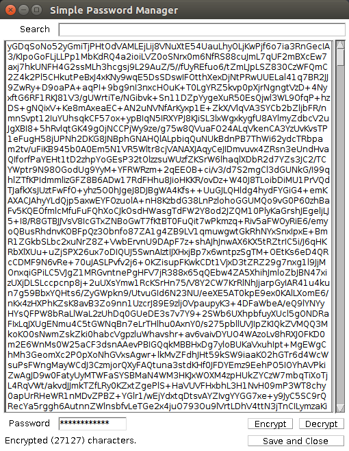

Password Manager
================

A personal desktop password manager I made years ago (2002) and just recently (2017) upgraded to use AES-256 instead of RC4. It's still working; I use it every day, and it works on Windows, OSX, and Ubuntu!

The encrypted passwords.txt file generated by this app is synced with Dropbox.

